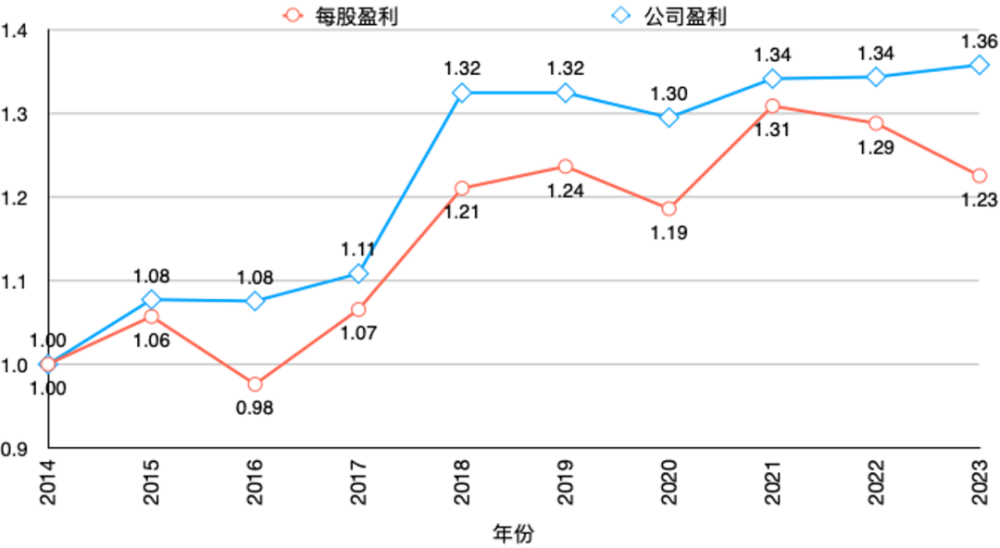

+++
date = '2026-10-05T18:08:39+08:00'
draft = false
title = '告别8%的宽基幻觉：万得全A未来十年的冷酷推演'
math = true

+++

>注：本文不是我写的。是在思考A股未来长期收益预期时，与Gemini交流，它指出如论是使用2006年为起点计算年化收益、以对数线性回归估算年化收益还是用滚动十年年化收益的平均值，都有各种不尽人意的地方。所以建议我回归约翰·博格最常用的经验法则，用股息率和内生增长去测算。于是请出Claude Opus 5.5，给了它2006年迄今万得全A的收盘价和市盈率、股息率数据，由它用Python试算并给出结果。当然，为了确保可读性，所以又请回Gemini 3.7 Flash来撰写本文，方便畅快阅读。预测的结果，显然不太乐观。为了避免404，公众号体系显然是不适合放的。所以就在这个Blog上作为AI预测股市长期收益的一个实验，立此存照。

1876年，开尔文勋爵（William Thomson）在格拉斯哥设计了一台机械潮汐预测机。

在海港边观测潮水是一件麻烦事。狂风与涌浪掀起数米高的波涛，如果只站在岸边盯着浪头，船长根本分不清当下的海平面到底是在涨还是在落。

为了滤掉喧嚣，工程师在码头底下修建了“验潮井”（Stilling Well）——用一根狭窄的进水管连通大海。汹涌的风浪通过细管时被阻尼自然抚平，井里的水面波澜不惊，只忠实记录受日月引力支配的真实天文潮位。

很多时候，看A股也像站在风浪滔天的码头上。

过去二十年，万得全A（881001）经历了大起大落。2007年整体市盈率冲到近49倍，2008年砸到14倍；2015年牛市狂欢，2018年寒意刺骨。如果只看价格指数的上下翻滚，难免让人产生某种幻觉：一会儿觉得A股长年有两位数复利，一会儿又陷入“保卫战”的沮丧。

如果我们也在A股建一口“验潮井”，把市场情绪带来的估值风浪彻底滤掉，水底下的真实水位究竟在以怎样的速度抬升？

## 验潮井里的两次换挡

万得全A是一只全收益指数，收盘价（\( P_{TR} \)）包含了分红再投资的复合累积。

按照金融学拆解恒等式：

\[ E_{TR} = \frac{P_{TR}}{\text{PE}} \]

序列 \( E_{TR} \) 就是“剥离估值倍数扰动后的全收益每股盈利指数”。对数差分之后，价格变动就被干净地拆成了两部分：一部分是内生价值增长，另一部分是估值乘数的周期漂移。

从2006年初的37点左右，到如今的295点，万得全A的内生价值序列 \( E_{TR} \) 在二十年里确实涨了近9倍。

不过，如果把这二十年切开看，水位的抬升轨迹呈现出极为剧烈的断裂。

利用统计检验寻找趋势断点，残差最优的结构断裂点落在 **2011年三季度**。断点前后，内生价值的增长斜率判若两人：

| 统计区间 | 时间跨度 (年) | 内生年化增速 (连续复利%) | 离散年化复合 增速(%) |
|---|---:|---:|---:|
| 2006–2011Q3（断点前） | 5.75 | 26.61 | 30.49 |
| 2011Q3–至今（断点后） | 14.75 | 3.98 | 4.06 |
| 2016–至今（后十年） | 10.50 | 3.33 | 3.39 |
| 2021–至今（近五年） | 5.00 | -0.59 | -0.59 |

在2011年之前，\( E_{TR} \) 年化复合增速高达26%以上。那是一个由入世红利、重工业化与超高名义GDP增速共同推动的黄金期，加上工行、中石油等大批低估值蓝筹集中上市，带来了指数成分的台阶式跳升。

但2011年之后，宏观经济中枢换轨，验潮井里的水位抬升速度骤降到了4%左右。到了过去十年（2016年至今），年化增速进一步放缓至3.33%。

近五年受地产周期下行与盈利承压影响，\( E_{TR} \) 甚至出现了短暂的平躺（从2021年末的294点到当下的295点）。

是的，过去十年万得全A内生价值的真实复合增长，中枢大致就在 3.3% 上下。

## 漏掉的一半动力

3.3% 的内生增速并不算高，更严峻的是，这还不是纯企业利润的增长。

因为万得全A是全收益指数，\( E_{TR} \) 天然已经包含了现金分红再投资的复利贡献。

过去十年，万得全A的年均股息率贡献约为 1.77%。如果将股息贡献剥离出去，万得全A每单位指数的纯每股盈利（EPS）增长，年化仅有 **1.56%**。即便采用三年移动平均来平滑盈利周期，这个数字也不过 1.17% 到 1.42%。

这引出了许多老投资者心中的困惑：过去十年，中国名义GDP年均增速依然有5%到7%，为什么全部A股的每股盈利增速只有 1.5%？

答案就在于留存收益的转化效率。

我们可以算一笔账：过去十年，万得全A的平均分红派息率约为38%，意味着上市公司留存了约 62% 的利润。以全市场平均 4.8% 的盈利收益率（E/P）计算，如果留存资金全部能以市场平均回报率做功，理论上每年能推动约 3.5% 的盈利内生增长。

但实际跑出来的每股盈利增速只有 1.56%。

转化效率仅有 45%。

剩下的 55% 动力，在漫长的资本循环中被稀释了：新股按高估值持续发行稀释了老股东权益、部分行业过度资本开支拖累了资本回报率、再融资与资产减值进一步消耗了内生留存。

宏观的名义增长是江河总量，但落实到投资人手里的每股收益，中途漏掉了不少水分。

## 未来十年的水位相位

看清了发动机的真实转速，再来测算未来十年的长期回报，框架就清晰了。

长期投资回报由三部分拼装而成：

\[ \text{预期回报} = g_{\text{EPS}} + \text{动态股息再投资} + \text{估值均值回归} \]

截至最新数据，万得全A的市盈率（PE-TTM）约为 21.0 倍，处于全历史的 66% 分位、后十年的 75% 分位，属于中枢偏上位置；近12个月股息率为 1.82%。

如果假设未来十年估值完成向历史常态的收敛，我们可以推演不同情景下的年化回报：

| 每股盈利增速情景 | 悲观情景 (回归P20估值 15.5倍)(%) | 中性情景 (回归中位数 19.1倍)(%) | 现状情景 (估值维持 21.0倍)(%) | 乐观情景 (回归P80估值 23.3倍)(%) |
|---|---:|---:|---:|---:|
| 偏弱 (g_EPS = 1.17%) | 0.22 | 2.12 | 3.02 | 3.98 |
| **中基准 (g_EPS = 1.55%)** | 0.60 | **2.51** | 3.41 | 4.38 |
| 偏强 (g_EPS = 2.20%) | 1.26 | 3.19 | 4.09 | 5.07 |

把这笔账拆开来看：
- 盈利增长：以过去十年的稳态中枢计，每年贡献约 1.55%；
- 动态股息再投资：随着估值向中位靠拢，股息率在 1.8% 到 2.1% 之间滑动，十年平均每年贡献约 1.89%；
- 估值变动：从当前的 21.0 倍回归至全历史中位数 19.1 倍，十年年化拖累约 0.96%。

三者相加，在中性基准下，**万得全A未来十年的预期复合年化回报率约为 2.5%**。

如果估值跌入历史低位（15.5倍左右），十年复合年化可能被压制在 0.6% 附近；如果市场重回偏乐观估值（23.3倍），年化回报有望达到 4.4%。

为了避免单一路径假设的偏差，我们通过平稳块自助法（Stationary Bootstrap）进行了 20,000 次蒙特卡洛抽样模拟。结果显示，未来十年年化回报的中位数落在 2.16%，25%到75%的分位数区间为 **0.06% 至 4.62%**，十年复合回报为负的概率约为 20% 到 24%。

需要说明的是，2.5% 是长期持有十年的**几何复合年化收益**。如果考虑到A股每年约 26% 的高波动率，在单年资产配置的**算术期望收益**口径下，数值约为 5.9% 左右。但对真正做长期资金规划的投资者而言，能落进口袋的复利，只能以 2.5% 为锚。

## 在平缓水面上掌舵

面对 2.5% 的中性预期，许多有十年以上投资经验的老朋友或许会有些不适应。

过去大家习惯了在狂暴的估值浪潮里冲浪，总觉得买入宽基指数，理所当然应该享受 8% 甚至 10% 的长期回报。

但翻开验潮井的记录簿，数据提示得很清楚：过去二十年的两位数增长，大半属于特定历史时期的单程票。当经济换挡、资本回报率尚未跃升，宽基指数水位的自发抬升已然放缓。

坦率讲，接受 2.5% 的基准不是为了悲观离场，而是为了换一张精准的航海图。

当贝塔水位的整体上涨变得平缓，超额收益的来源反而更加纯粹：

第一，**向留存效率要收益**。既然全市场留存的 62% 利润只有不到一半能转化为股东收益，那么主动选择商业模式成熟、不再盲目扩产、愿意把现金流大比例分红给股东的红利与高质量资产，就能在源头上避开稀释损失。

第二，**向估值周期要弹性**。既然内生中枢只有 2.5%，那么买入时的估值水位就决定了大半收益。在 PE 跌至 15 倍以下的冰点区域逆向布局，估值修复每年能拉动 2% 到 3%，在低回报环境中就是决定胜负的厚雪。

第三，**观察制度红利的释放**。如果未来的分红指引、注销式回购与并购重组监管能够改善资本配置，将 45% 的留存转化率拉升至 70% 甚至更高，全市场的内生预期就有望重回 3.5% 到 4% 的台阶。

开尔文的潮位预测机平息不了海面风浪，但让出海的船长知道了脚下真实的水深。

认清 2.5% 的底色，你才不会在估值顺流时错把浪头当成常态，也不会在风平浪静的日子里，迷失了前进的方向。

后补：在blog发布完此外，想着顺便再找点资料佐证。看到了长江商学院的一篇文章《[欧阳辉、曹辉宁——救市不能靠暂缓IPO - 观点 - 教授/研究 - 长江商学院](https://www.ckgsb.edu.cn/faculty/article/detail/157/6962.html)》，里面有一张图和一个数据：

>从2014年至2023年，沪深300的公司盈利和每股盈利是逐步上涨的，但每股盈利的上涨幅度不如公司盈利。与2014年相比，2022年的公司盈利上涨了36%，而每股盈利只上涨了23%。

我算了一下，9年23%的增长，年化只有区区2.3%。在利润这样的增速之下，叠加起点不高的股息率，长期收益不高，也可以理解了。这也算佐证了AI对万得全A的测算。看到这个数据，真是只能一阵叹息。
